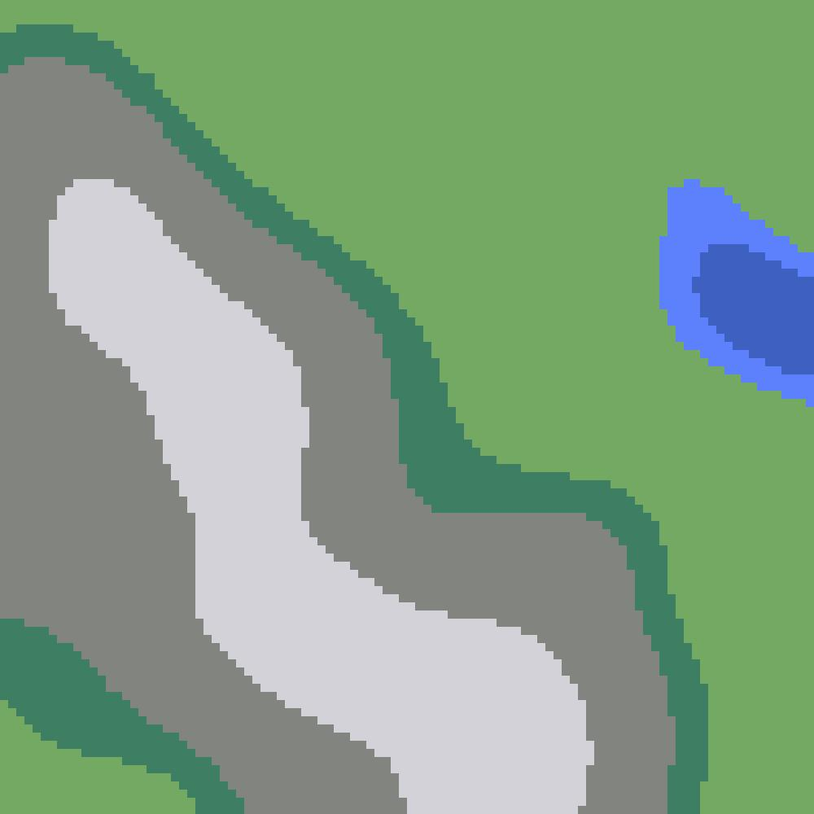
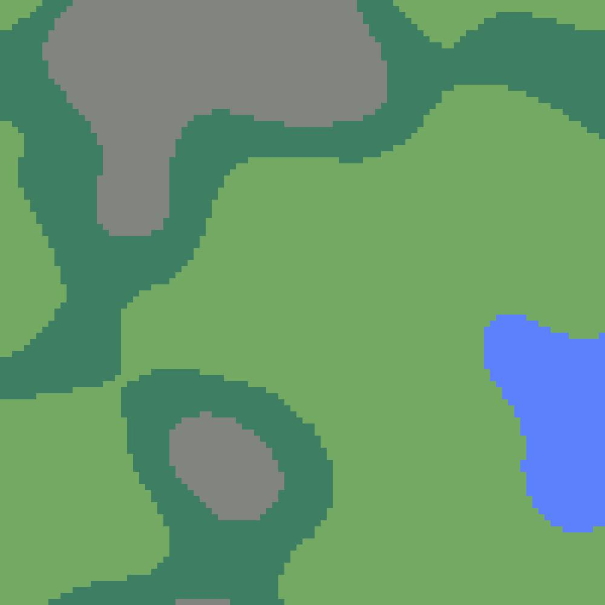
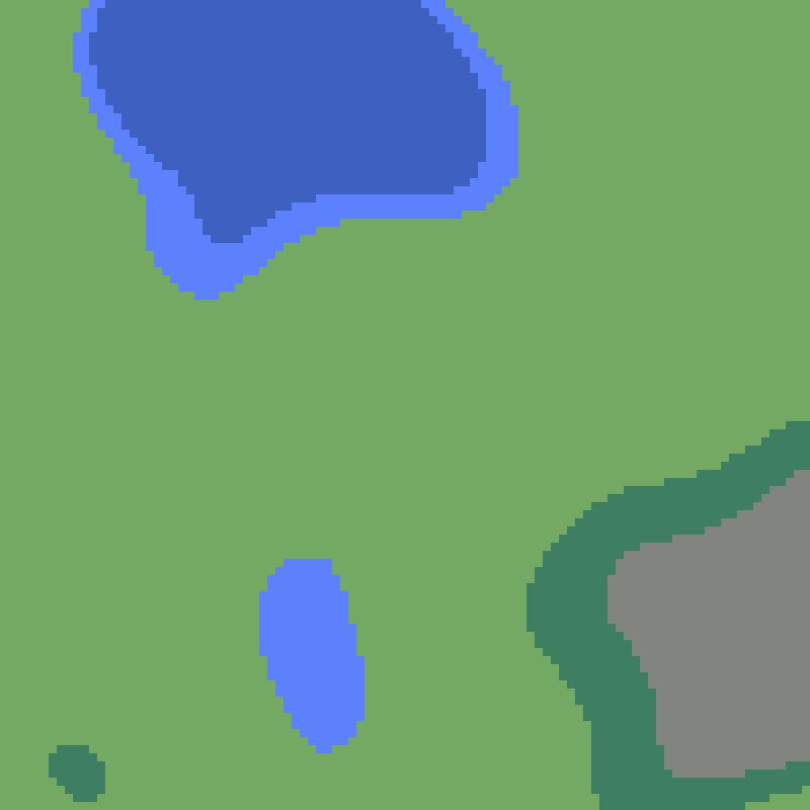

# vbmapg

vbmapg is a procedural generation library for 2D-maps in Go. Based on perlin-noise.

## Usage

```shell
$ gen <width> <height> [Optional: <filename.jpeg>]
```

### Create an example map encoded in JPG

```shell
$ go run -mod=vendor cmd/gen/gen.go 100 100 example.jpg
```

## Examples

|  |  |
| ----- | ----- |
|  |  |
|  |  |
|  |  |
